**МИНИСТЕРСТВО НАУКИ И ВЫСШЕГО ОБРАЗОВАНИЯ РОССИЙСКОЙ ФЕДЕРАЦИИ**

федеральное государственное бюджетное образовательное учреждение

высшего образования

**«УЛЬЯНОВСКИЙ ГОСУДАРСТВЕННЫЙ ТЕХНИЧЕСКИЙ УНИВЕРСИТЕТ»**

Факультет  *информационных систем и технологий*					

Кафедра  *Измерительно-вычислительные комплексы*					

Дисциплина  *Моделирование информационных систем*				

**КУРСОВАЯ РАБОТА**

Тема  *Моделирование информационной системы сервисного центра*										     				     	

Выполнил студент  					*/	Ефременко С.А.		/*

`				      `*подпись				инициалы, фамилия*

Курс  	*3*				Группа  *ИСТбд-41*		

Направление  *09.03.02 «Информационные системы и технологии»*		

Руководитель  *доцент кафедры ИВК, к.т.н., доцент*					

`				`*должность, учёная степень, учёное звание*

` `*Родионов Виктор Викторович*								

`					`*фамилия,имя, отчество*

Дата сдачи:

«      »                          20      г.

Дата защиты:

«      »                          20      г.

Оценка:				

Ульяновск

2025\.

**МИНИСТЕРСТВО НАУКИ И ВЫСШЕГО ОБРАЗОВАНИЯ РОССИЙСКОЙ ФЕДЕРАЦИИ**

федеральное государственное бюджетное образовательное учреждение

высшего образования

**«УЛЬЯНОВСКИЙ ГОСУДАРСТВЕННЫЙ ТЕХНИЧЕСКИЙ УНИВЕРСИТЕТ»**

Факультет  *информационных систем и технологий*					

Кафедра  *Измерительно-вычислительные комплексы*					

Дисциплина  *Моделирование информационных систем*				

**ЗАДАНИЕ НА КУРСОВУЮ РАБОТУ**

студенту  *гр. ИСТбд-41				Ефременко С.А.*				

`		      `*группа					фамилия, инициалы*

Тема работы  *Моделирование информационной системы сервисного центра*														

Срок сдачи законченной работы «      »                          20      г.

Исходные данные к работе  *методические указания к выполнению курсовой*	

`         `*(базовое предприятие, характер курсовой работы:*

*работы и проведению практических занятий для студентов направления* 

*задание кафедры, инициативная НИР, рекомендуемая литература, материалы практики)*

*09.03.03 «Информационные системы и технологии» по дисциплине*		

*«Моделирование информационных систем» Родионова В.В.*				

Содержание пояснительной записки *введение, техническое задание,*		 

*информационное обеспечение системы, алгоритмическое обеспечение*		 

*системы, прикладное программное обеспечение системы, руководство*	 

*пользователя, список использованных источников.*					

Перечень графического материла*  																				

Руководитель  *доцент каф. ИВК					/ В.В. Родионов /*

`		      	    `*должность			     подпись		инициалы, фамилия*

«      »                          20      г.

Студент  							*/     Ефременко С.А.              /*

`		      	       `*подпись					 инициалы, фамилия*

«      »                          20      г.

![ref1]
![ref2]![ref3]![ref2]

**Содержание**

Введение	5

1 ФУНКЦИОНАЛЬНАЯ МОДЕЛЬ, МОДЕЛЬ ПОТОКОВ РАБОТ И МОДЕЛЬ ПОТОКОВ ДАННЫХ	8

1\.1 Исходная модель	8

1\.1.1 Контекстная диаграмма А-0 «Обеспечить работу сервисного центра» 	8

1\.1.2 Диаграмма декомпозиции А0 «Обеспечить работу сервисного центра» 	9

1\.1.3 Диаграмма декомпозиции А1 «Принять и зарегестрировать заявку» 	11

1\.1.4 Диаграмма декомпозиции А2 «Провести диагностику и оценку стоимости» 	12

1\.1.5 Диаграмма декомпозиции А3 «Выполнить ремонт и тестирование» 	14

1\.1.6 Диаграмма декомпозиции А4 «Закрыть заказ и оформить отчетность» 	15

1\.1.7 DFD-диаграмма А11 «Принять обращение клиента» 	17

1\.1.8 IDEF3-диаграмма А33 «Провести тестирование устройства» 	18

1\.1.9 IDEF3-диаграмма А32 «Произвести ремонт» 	18

![ref4]![ref5]![ref5]![ref6]![ref6]![ref7]![ref7]![ref4]![ref8]![ref8]![ref8]![ref8]![ref8]![ref8]![ref9]![ref10]![ref11]![ref11]![ref11]![ref8]![ref3]![ref3]
![ref12]![ref3]![ref12]

1\.2 Полученная модель	20

1\.2.1 Контекстная диаграмма А-0 «Обеспечить работу сервисного центра» 	20

1\.2.2 Диаграмма декомпозиции А0 «Обеспечить работу сервисного центра» 	21

1\.2.3 Диаграмма декомпозиции А2 «Принять и зарегестрировать заявку» 	22

1\.2.4 Диаграмма декомпозиции А3 «Провести диагностику и оценку» 	23

1\.2.5 Диаграмма декомпозиции А4 «Выполнить ремонт и тестирование» 	24

1\.2.6 Диаграмма декомпозиции А5 «Закрыть заказ и оформить отчетность» 	25

1\.2.7 DFD-диаграмма А22 «Зарегестрировать заявку в журнале» 	26

1\.3 Сравнительный анализ исходной и полученной моделей	26

2 ИНФОРМАЦИОННАЯ МОДЕЛЬ	28

2\.1 Концептуальная схема базы данных	28

2\.1.1 Модель «Сущность-связь» 	28

2\.1.2 сущности и их атрибуты	28

2\.1.3 Связи между сущностями	28

Список использованных источников	29

**ВВЕДЕНИЕ**

Современные условия развития экономики характеризуются высокой конкуренцией и требовательностью потребителей к качеству услуг. Это в полной мере относится к сектору сервисных центров, которые специализируются на техническом обслуживании, ремонте и сопровождении разнообразной техники – от персональных компьютеров и бытовой электроники до сложного промышленного оборудования. Деятельность таких организаций является критически важной для обеспечения бесперебойной работы технологических цепочек как в корпоративном, так и в частном сегментах.

Ключевой особенностью предметной области сервисного центра является необходимость управления сквозным процессом, который начинается с момента регистрации заявки от клиента и завершается выдачей отремонтированного устройства и закрытием финансовых документов. Этот процесс включает в себя несколько взаимосвязанных этапов: первичную диагностику, составление и согласование коммерческого предложения, непосредственно ремонт (который может требовать управления ожиданием запчастей), тестирование и финальную проверку качества. Каждый этап генерирует значительный объем информации: данные о клиенте, характеристики оборудования, история обращений, описание неисправностей, статусы выполнения работ, учет запчастей и трудозатрат специалистов.

Традиционные методы управления этим потоком данных – бумажные журналы, электронные таблицы (например, Excel) или набор разрозненных компьютерных программ – зачастую не справляются с возрастающей нагрузкой. При увеличении количества обращений эти методы становятся источником ошибок, потери информации и непрозрачности процессов. Возникают типичные проблемы: дублирование данных, сложности с поиском истории ремонтов конкретного устройства, отсутствие актуальной информации о наличии запчастей на складе, задержки в оповещении клиентов о статусе заказа и проблемы с формированием оперативной отчетности для руководства. Это приводит к снижению скорости обслуживания, ошибкам в расчетах и, как следствие, к падению удовлетворенности клиентов.

Предметная область сервисного центра универсальна для многих отраслей. Аналогичные бизнес-процессы характерны для IT-аутсорсинговых компаний, автомобильных сервисов, центров по ремонту бытовой техники и медицинского оборудования. Во всех случаях присутствуют общие сущности: «Клиент», «Заявка на обслуживание» (заказ-наряд), «Оборудование», «Склад запчастей», «Сотрудник» (инженер, менеджер) и «Работы/Услуги». Специфика может заключаться в номенклатуре запчастей, сложности диагностики или требованиях к отчетности, но ядро процессов остается единым.

Таким образом, предметная область деятельности сервисного центра представляет собой сложную, многоаспектную среду, управление которой требует четкой координации материальных, временных и информационных ресурсов. Существующие ручные и полуавтоматические методы учета не соответствуют современным требованиям к оперативности, точности и прозрачности бизнес-процессов, что подтверждается анализом типовых проблем и изучением опыта, отраженного в профильных исследованиях. 

В процессе работы над описанием и созданием автоматизированной системы был проведен анализ ряда источников, посвященных вопросам моделирования, автоматизации и проектирования информационных систем в сфере сервисного обслуживания.

Исследование Кузнецова А.В. и Петровой И.С. «Разработка технологии моделирования бизнес-процессов в сфере сервиса» (2022) посвящено методологическим аспектам моделирования. Авторы рассматривают особенности применения различных нотаций для описания процессов в сервисных организациях, что имеет прямую практическую ценность для адекватного отображения деятельности сервисного центра в моделях.

Работа Смирнова В.Л. «Автоматизированная система диспетчеризации сервисного центра ООО «Кибер» (2021) предоставляет пример успешной реализации АИС в конкретной организации. В статье подчеркивается, что автоматизация диспетчерских функций позволила значительно повысить оперативность распределения заявок и прозрачность всего процесса обслуживания, что подтверждает практическую значимость внедрения подобных систем.

Статья Федорова К.Д. «Разработка информационной системы для организации работы сервисного центра» (2020) фокусируется на структурном проектировании ИС. Автор подробно рассматривает вопросы формирования требований к системе, проектирования базы данных и пользовательского интерфейса, что является важным ориентиром при создании архитектуры проектируемой системы.

Учебное пособие Кулябова Д.С. и Корольковой А.В. «Введение в формальные методы описания бизнес-процессов» (2008) служит теоретической основой для понимания и применения методологий IDEF0 и DFD. Несмотря на год издания, оно остается актуальным источником, систематизирующим принципы структурного подхода к моделированию.

Статья «Управление IT-сервисами: основы, методы, примеры» с платформы Habr служит практическим руководством, раскрывающим ключевые принципы работы сервисного центра «НАГ», который занимается обслуживанием и ремонтом телекоммуникационного оборудования. В ней описывается процесс работы с оборудованием: от оформления заявки и диагностики до ремонта и финальной проверки.

**1 ФУНКЦИОНАЛЬНАЯ МОДЕЛЬ, МОДЕЛЬ ПОТОКОВ РАБОТ И МОДЕЛЬ ПОТОКОВ ДАННЫХ**

1\.1 Исходная модель	

1\.1.1 Контекстная диаграмма А-0 «Обеспечить работу сервисного центра»

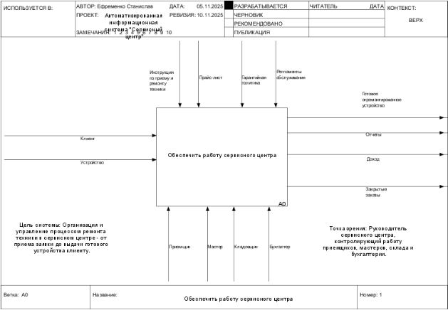

Рисунок 1 – Контекстная диаграмма А-0 «Обеспечить работу сервисного центра» в IDEF0

На рисунке 1 изображена контекстная диаграмма «Обеспечить работу сервисного центра». Для обеспечения деятельности сервисного центра входной информацией является клиенты и устройства, поступающие в ремонт.

`	`Управляющей информацией служат: инструкция по приему и ремонту техники, прайс-лист, гарантийная политика и регламенты обслуживания.

`	`К механизму управления относятся приемщик, мастер, кладовщик и бухгалтер.

`	`Выходной информацией служит готовое отремонтированное устройство, отчеты, доход, закрытые заказы.

1\.1.2 Диаграмма декомпозиции А0 «Обеспечить работу сервисного центра»

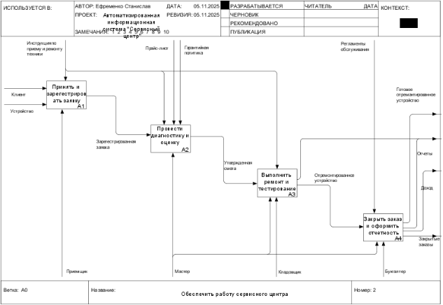

Рисунок 2 – Диаграмма декомпозиции А0 «Обеспечить работу сервисного 

центра» в IDEF0.

`	`Рассмотрим подробнее процессы, изображенные на диаграмме декомпозиции на рисунке 2. Здесь содержится 4 процесса, необходимых для функионирования сервисного центра.

Процессы:

1. Принять и зарегистрировать заявку:
- Входная информация: Клиент, устройство.
- Выходная информация: Зарегестрированная заявка.
- Управление: Инструкция по приему и ремонту техники.
- Механизм управления: Приемщик.
1. Провести диагностику и оценку:
- Входная информация: Зарегестрированная заявка.
- Выходная информация: Утвержденная смета.
- Управление: Инструкция по приему и ремонту техники, Прайс-лист, Гарантийная политика.
- Механизм управления: Мастер.
1. Выполнить ремонт и тестирование:
- Входная информация: Утвержденная смета.
- Выходная информация: Отремонтированное устройство.
- Управление: Инструкция по приему и ремонту техники.
- Механизм управления: Мастер, Кладовщик.
1. Закрыть заказ и оформить отчетность:
- Входная информация: Отремонтированное устройство.
- Выходная информация: Готовое отремонтированное устройство, Отчеты, Доход, Закрытые заказы.
- Управление: Регламенты обслуживания.
- Механизм управления: Мастер, Бухгалтер.

1\.1.3 Диаграмма декомпозиции А1 «Принять и зарегестрировать заявку»

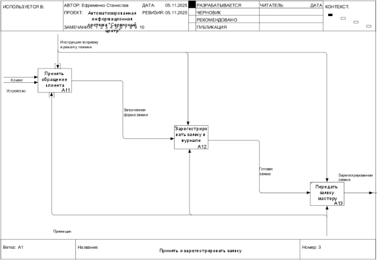

Рисунок 3 – Диаграмма декомпозиции А1 «Приянть и зарегестрировать заявку» в IDEF0

Рассмотрим подробнее процессы, изображенные на диаграмме декомпозиции на рисунке 3. Здесь содержится 3 процесса, необходимых для функционирования сервисного центра.

Процессы:

1. Принять обращение клиента:
- Входная информация: Клиент, Устройство.
- Выходная информация: Заполненная форма заявки.
- Управление: Инструкция по приему и ремонту техники.
- Механизм управления: Приемщик.
1. Зарегестрировать заявку в журнале:
- Входная информация: Заполненная форма заявки.
- Выходная информация: Готовая заявка.
- Управление: Инструкция по приему и ремонту техники.
- Механизм управления: Приемщик.
1. Передать заявку мастеру:
- Входная информация: Готовая заявка.
- Выходная информация: Зарегестрированная заявка.
- Управление: Инструкция по приему и ремонту техники.
- Механизм управления: Приемщик.

1\.1.4 Диаграмма декомпозиции А2 «Провести диагностику и оценку стоимости»

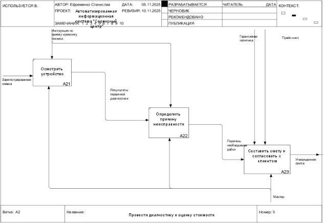

Рисунок 4 – Диаграмма декомпозиции А2 «Провести диагностику и оценку» в IDEF0

Рассмотрим подробнее процессы, изображенные на диаграмме декомпозиции на рисунке 4. Здесь содержится 3 процесса, необходимых для функционирования сервисного центра.

`	`Процессы:

1. Осмотреть устройство:
- Входная информация: Зарегестрированная заявка.
- Выходная информация: Результаты первичной диагностики.
- Управление: Инструкция по приему и ремонту техники.
- Механизм управления: Мастер.
1. Определить причину неисправности:
- Входная информация: Результаты первичной диагностики.
- Выходная информация: Перечень необходимых работ.
- Управление: Инструкция по приему и ремонту техники.
- Механизм управления: Мастер.
1. Составить смету и согласовать с клиентом:
- Входная информация: Перечень необходимых работ.
- Выходная информация: Утвержденная смета.
- Управление: Гарантийная политика.
- Механизм управления: Мастер.

1\.1.5 Диаграмма декомпозиции А3 «Выполнить ремонт и тестирование»

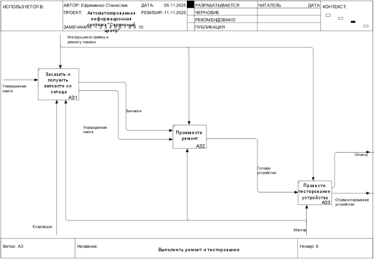

Рисунок 5 – Диаграмма декомпозиции А3 «Выполнить ремонт и тестирование» в IDEF0

Рассмотрим подробнее процессы, изображенные на диаграмме декомпозиции на рисунке 7. Здесь содержится 3 процесса, необходимых для функционирования сервисного.

Процессы:

1. Заказать и получить запчасти со склада:
- Входная информация: Утвержденная смета.
- Выходная информация: Запчасти, Утвержденная смета.
- Управление: Инструкция по приему и ремонту техники.
- Механизм управления: Кладовщик, Мастер.
1. Произвести ремонт:
- Входная информация: Запчасти, Утвержденная смета.
- Выходная информация: Готовое устройство.
- Управление: Инструкция по приему и ремонту техники.
- Механизм управления: Мастер.
1. Произвести тестирование устройства:
- Входная информация: Готовое устройство.
- Выходная информация: Отчеты, Отремонтированное устройство.
- Управление: Инструкция по приему и ремонту техники.
- Механизм управления: Мастер.

1\.1.6 Диаграмма декомпозиции А4 «Закрыть заказ и оформить отчетность»

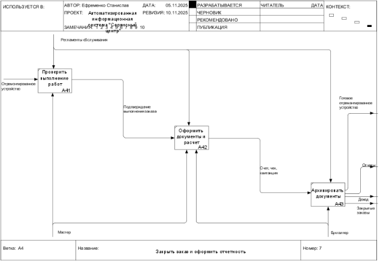

Рисунок 6 – Диаграмма декомпозиции А4 «Закрыть заказ и оформить отчетность» в IDEF0

`	`Рассмотрим подробнее процессы, изображенные на диаграмме декомпозиции на рисунке 6. Здесь содержится 3 процесса, необходимых для функционирования сервисного центра.

Процессы:

1. Проверить выполнение работ:
- Входная информация: Отремонтированное устройство.
- Выходная информация: Подтверждение выполнения заказа.
- Управление: Регламенты обслуживания.
- Механизм управления: Мастер.
1. Оформить документы и расчет:
- Входная информация: Подтверждение выполнения заказа.
- Выходная информация: Счет, чек, квитанция.
- Управление: Регламенты обслуживания.
- Механизм управления: Мастер, Бухгалтер.
1. Архивировать документы:
- Входная информация: Счет, чек, квитанция.
- Выходная информация: Готовое отремонтированное устройство, Отчеты, Доход, Закрытые заказы.
- Управление: Регламенты обслуживания.
- Механизм управления: Бухгалтер.

1\.1.7 DFD-диаграмма А11 «Принять обращение клиента»

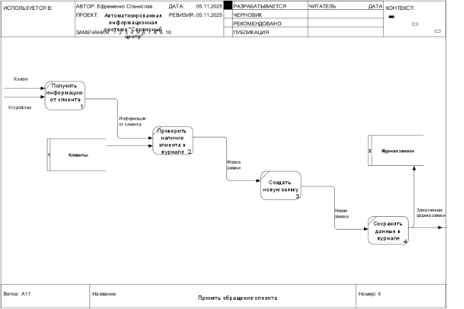

Рисунок 7 – DFD диаграмма А11 «Принять обращение клиента»

`	`Рассмотрим подробнее процессы, изображенные на DFD диаграмме на рисунке 7. Здесь содержится 4 процесса и 2 хранилища данных.

`	`Хранилища данных:

1. Клиенты.
1. Журнал заявок.

Процессы:

1. Получить информацию от клиента:
- Входные данные: Клиент, Устройство.
- Выходные данные: Информация от клиента.
1. Проверить наличие клиента в журнале:
- Входные данные: Информация от клиента.
- Выходные данные: Форма заявки.
1. Создать новую заявку:
- Входные данные: Форма заявки.
- Выходные данные: Новая заявка.
1. Сохранить данные в журнале:
- Входные данные: Новая заявка.
- Выходные данные: Заполненная форма заявки.

1\.1.8 IDEF3-диаграмма А33 «Провести тестирование устройства»

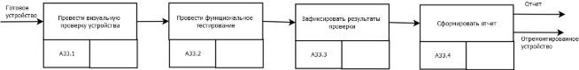

Рисунок 8 – IDEF3 диаграмма А33 «Провести тестирование устройства»

`	`Рассмотрим подробнее процессы, изображенные на IDEF3-диаграмме на рисунке 8. На рисунке описан процесс тестирования устройства. После поступления готового устройства, проводятся визуальная проверка и функциональное тестирование, результаты которых фиксируются и на основании этого формируется отчет.

1\.1.9 IDEF3-диаграмма А32 «Произвести ремонт»

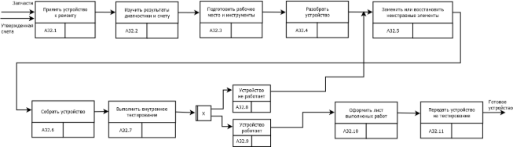

Рисунок 9 – IDEF3 диаграмма А32 «Произвести ремонт»

`	`Рассмотрим подробнее процессы, изображенные на IDEF3-диаграмме на рисунке 9. На рисунке описан процесс ремонта. После поступления запчастей и утвержденной сметы, принимается устройство для ремонта и изучаются результаты диагностики и сметы. После подготовки рабочего места и инструмента, устройство разбирается, заменяются или восстонавливаются его неисправные элементы и собирается. После ремонта проводится первичное тестирование, если устройство не работает, то оно возвращается на этап замены или восстановления неисправных элементов, если устройство работает, то оформляется лист выполненных работ и отправляется на тестирование.

1\.2 Полученная модель

1\.2.1 Контекстная диаграмма А-0 «Обеспечить работу сервисного центра»

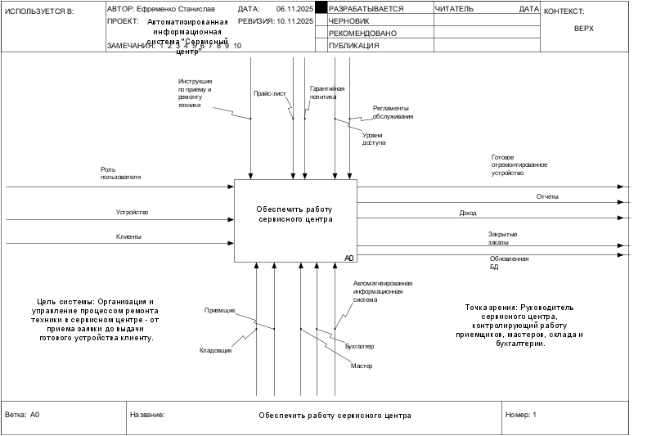

Рисунок 10 – Контекстная диаграмма А-0 «Обеспечить работу сервисного центра» в IDEF0

`	`На рисунке 10 представлена контекстная диаграмма в нотации IDEF0 для описания автоматизированной системы. Различие с неавтоматизированной версией диаграммы заключается в разделении ролей пользователей. В сисетме предусмотрены четыре ролия: Приемщик, Кладовщик, Бухгалтер, Мастер, что говорит о разных уровнях доступа. Также можно заметить, что на выходе есть стрелка, которая говорит о заполнении базы данных.

1\.2.2 Диаграмма декомпозиции А0 «Обеспечить работу сервисного центра»

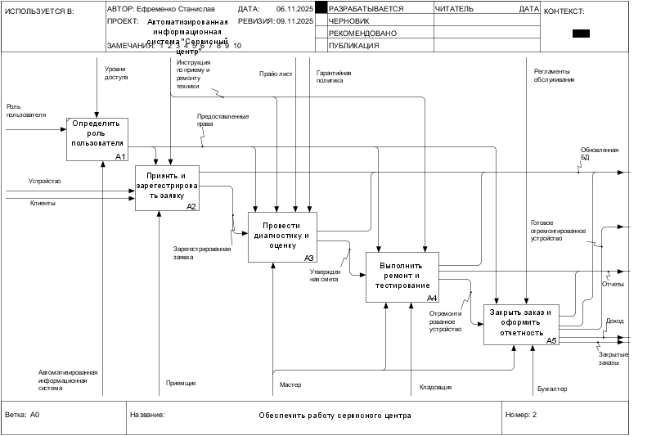

Рисунок 11 – диаграмма декомпозиции А0 «Обеспечить работу сервисного ентра» в IDEF0

`	`На рисунке 11 представлена диаграмма декомпозиции в нотации IDEF0 для рписания автоматизированной системыю Различие с неавтоматизированной версией диаграммы заключается в добавлении процесса определения роли пользователя, а также работы с базой данных. Здесь видно, что за процессом определения роли отвечает автоматизированная информационная система.

Информация по процесу «Определить роли пользователя»:

- Входная информация: Роль пользователя.
- Выходная информаия: Предоставленные права.
- Управление: Уровни доступа.
- Механизм управления: Автоматизированная информационная система.

1\.2.3 Диаграмма декомпозиции А2 «Принять и зарегестрировать заявку»

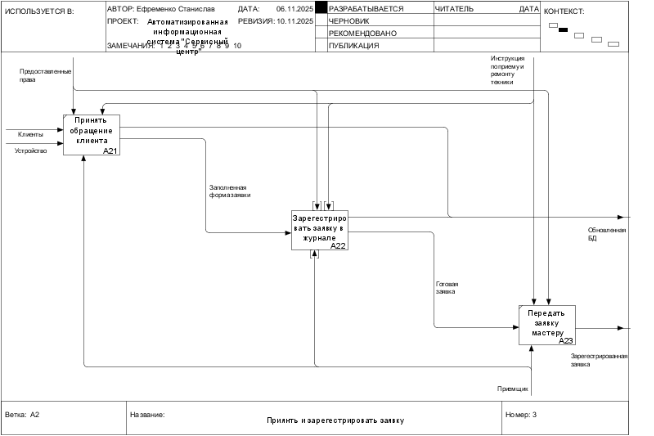

Рисунок 12 – Диаграмма декомпозиции А2 «Приянть и зарегестрировать заявку» в IDEF0

`	`На рисунке 12 представлена диаграмма декомпозиции в нотации IDEF0 для описания автоматизированной системы. Различие с неавтоматизированной версией диаграммы заключается в предоставлении прав для пользователей. Как можно увидеть, приемщик по мере выполнения задач, может вносить изменения в базу данных.

1\.2.4 Диаграмма декомпозиции А3 «Провести диагностику и оценку»

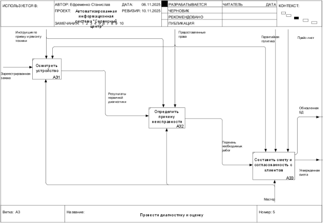

Рисунок 13 – Диаграмма декомпозиции А3 «Провести диагностику и оценку»

На рисунке 13 представлена диаграмма декомпозиции в нотации IDEF0 для описания автоматизированной системы. Различие с неавтоматизированной версией диаграммы заключается в предоставлении определенных прав пользователей. Как можно увидеть, мастер после выполнения задач, вносит изменения в базу данных.

1\.2.5 Диаграмма декомпозиции А4 «Выполнить ремонт и тестирование»

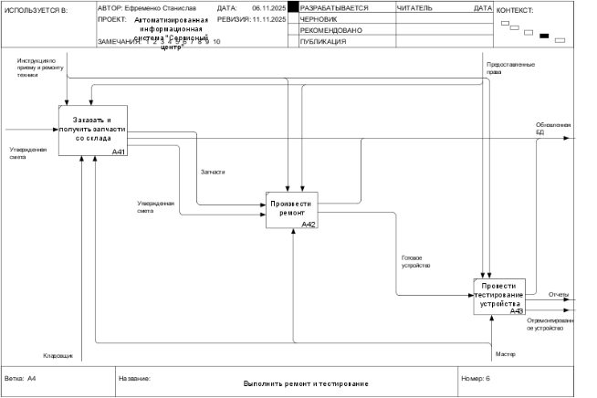

Рисунок 14 Диаграмма декомпозиции А4 «Выполнить ремонт и тестирование» в IDEF0

На рисунке 14 представлена диаграмма декомпозиции в нотации IDEF0 для описания автоматизированной системы. Различие с неавтоматизированной версиейй диаграммы заключается в предоставлении определенных прав для пользователей. Как можно увидеть, мастер по мере выполнения задач, может вносить записи в базу данных.

1\.2.6 Диаграмма декомпозиции А5 «Закрыть заказ и оформить отчетность»

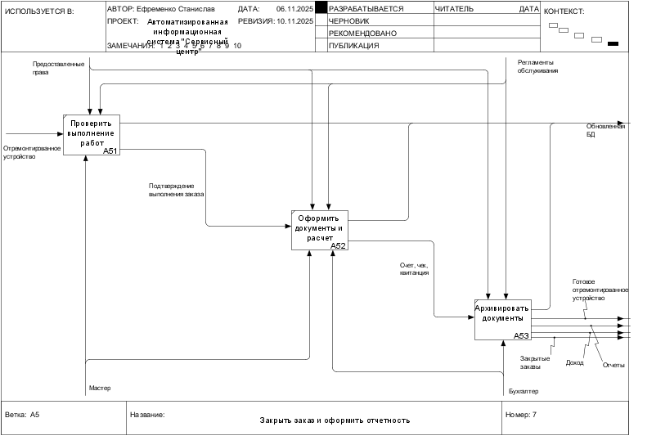

Рисунок 15 – Диаграмма декомпозиции А5 «Закрыть заказ и оформить отчетность» в IDEF0

`	`На рисунке 15 представлена диаграмма декомпозиции в нотации IDEF0 для описания автоматизированной системы. Различие с неавтоматизированной версией диаграммы заключается в предоставлении определенныз прав для пользователей. Как можно увидеть мастер и бухгалтер по мере выполнения задач могут вносить изменения в базу данных.

1\.2.7 DFD-диаграмма А22 «Зарегестрировать заявку в журнале»

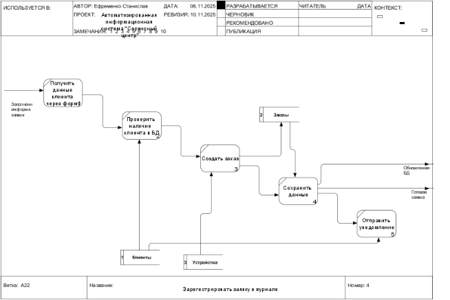

Рисунок 16 – DFD диаграмма А22 «Зарегестрировать заявку в журнале»

На рисунке 16 представлена DFD диаграмма потоков данных «Зарегестрировать заявку в журнале». Здесь мы видим, что все все хранилища имеют название сущностей из базы данных. Помимо этого, на выходе мы видим стрелку, характеризующую заполненную базу данных.

1\.3 Сравнительный анализ исходной и полученной моделей

В РАМКАХ КУРСОВОЙ РАБОТЫ БЫЛИ РАЗРАБОТАНЫ ДВЕ МОДЕЛИ УПРАВЛЕНИЯ ДАННЫМИ ДЛЯ СЕРВИСНОГО ЦЕНТРА: ИСХОДНАЯ (НЕАВТОМАТИЗИРОВАННАЯ) И УСОВЕРШЕНСТВОВАННАЯ (АВТОМАТИЗИРОВАННАЯ). ОСНОВНОЕ ОТЛИЧИЕ МЕЖДУ НИМИ ЗАКЛЮЧАЕТСЯ В ТОМ, ЧТО В АВТОМАТИЗИРОВАННОЙ МОДЕЛИ ОСОБОЕ ВНИМАНИЕ УДЕЛЯЕТСЯ БАЗЕ ДАННЫХ. БОЛЕЕ ПОДРОБНО О АИС СЕРВИСНОГО ЦЕНТРА МОЖНО УЗНАТЬ ИЗ ПОЯСНИТЕЛЬНОЙ ЗАПИСКИ К КУРСОВОЙ РАБОТЕ ПО ДИСЦИПЛИНЕ «БАЗЫ ДАННЫХ».

АУТЕНТИФИЦИРОВАННЫЕ ПОЛЬЗОВАТЕЛИ АИС МОГУТ ПРОСМАТРИВАТЬ ЗАПИСИ, РЕДАКТИРОВАТЬ И УДАЛЯТЬ ИХ. КРОМЕ ЭТОГО ОНИ МОГУТ ПОЛЬЗОВАТЬСЯ ДОПОЛНИТЕЛЬНЫМ ФУНКЦИОНАЛОМ СИСТЕМЫ. К НЕМУ ОТНОСЯТСЯ ФОРМИРОВАНИЕ ОТЧЕТА ПО ВЫРУЧКЕ И ОТЧЕТА ПО ОБЩЕЙ ИНФОРМАЦИИ О ЗАКАЗЕ.

АИС ЗНАЧИТЕЛЬНО УПРОЩАЕТ РАБОТУ СЕРВИСНОГО ЦЕНТРА, ПРЕДОСТАВЛЯЯ ДАННЫЕ В БОЛЕЕ УДОБНОМ ФОРМАТЕ С ПОМОЩЬЮ ПОИСКА И РАЗЛИЧНЫХ ФИЛЬТРОВ. СИСТЕМА ОРГАНИЗУЕТ ВСЕ ДАННЫЕ В СТРУКТУРИРОВАННОМ ВИДЕ И СЛЕДИТ ЗА ЦЕЛОСТНОСТЬЮ, ЧТО ПОМОГАЕТ ПРЕДОТВРАТИТЬ ИХ ПОТЕРЮ. ПОЛЬЗОВАТЕЛЬ В ЛЮБОЙ МОМЕНТ МОЖЕТ БЫСТРО НАЙТИ НУЖНУЮ ИНФОРМАЦИЮ. ЭТОТ ПОДХОД ЯВЛЯЕТСЯ ЭФФЕКТИВНЫМ, ТАК КАК В СЕРВИСНОМ ЦЕНТРЕ ПРОВОДИТСЯ МНОЖЕСТВО РЕМОНТОВ ТЕХНИКИ В ТЕЧЕНИИ ГОДА.

НЕДОСТАТКОМ АИС ЯВЛЯЕТСЯ ПОДДЕРЖАНИЕ ЕЕ РАБОТОСПОСОБНОСТИ. ПРИ СБОЕ СИСТЕМЫ ПОЛЬЗОВАТЕЛИ МОГУТ ПОТЕРЯТЬ ДОСТУП К ДАННЫМ. РЕШЕНИЕМ ЯВЛЯЕТСЯ НАЛИЧИЕ РЕЗЕРВНОГО СЕРВЕРА, КОТОРЫЙ БУДЕТ ХРАНИТЬ КОПИЮ БАЗЫ ДАННЫХ.**2 ИНФОРМАЦИОННАЯ МОДЕЛЬ**

2\.1 КОНЦЕПТУАЛЬНАЯ СХЕМА БАЗЫ ДАННЫХ

2\.1.1 МОДЕЛЬ «СУЩНОСТЬ-СВЯЗЬ»

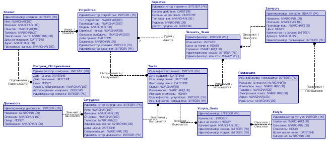

2\.1.2 сущности и их атрибуты

`	`Сущность «Контракт\_Обслуживания» содержит в себе информацию о долгосрочных соглашениях с постоянными клиентами. Она включает в себя атрибуты: «Идентификатор контракта», «Дата начала», «Дата окончания», «Цена», «Уровень обслуживания», «Автопродление контракта», «Идентификатор клиента».

2\.1.3 Связи между сущностями

Отношение «Подписывает/Подписывается» типа «один-ко-многим» связывает между собой сущности «Клиент» и «Контракт\_Обслуживание». Один клиент может иметь несколько контрактов. Для сущности «Клиент» минимальное кардинальное число – 0, а максимальное – N, так как один клиент может иметь как несколько контрактов, так и вовсе их не иметь. Для сущности «Контракт\_Обслуживания» минимальное кардинальное число – 1, а максимальное 1, так как каждый контракт обязательно связан с одним клиентом и не может существовать без него.

**СПИСОК ИСПОЛЬЗОВАННЫХ ИСТОЧНИКОВ**

1\. Абсатаров Р.Н., Абрамова О.Ф. Исследование деятельности сервисного центра компьютерной техники и анализ осуществимости автоматизации бизнес-процессов / Р.Н. Абсатаров, О.Ф. Абрамова // Научный журнал «Исследование деятельности сервисного центра». — Волжский : Волжский политехнический институт филиал ФГБОУ ВО «ВолгГТУ», 2020. — 10 с. — Текст : электронный ресурс. — URL: https://science-engineering.ru/ru/article/view?id=1309 (дата обращения: 15.09.2025).

2\. ГОСТ Р 7.0.100-2018. Система стандартов по информации, библиотечному и издательскому делу. Библиографическая запись. Библиографическое описание. Общие требования и правила составления: национальный стандарт Российской Федерации: издание официальное: дата введения 2018-01-01 / разработан ФГУП "ИТАР-ТАСС". – Москва: Стандартинформ, 2018. 124 c. – Текст: непосредственный

3\. Дашенко А.А. Проектирование АИС для автоматизации деятельности сервисного центра / А.А. Дашенко. — 2023. — Текст : электронный ресурс. — URL: https://cyberleninka.ru/article/n/proektirovanie-ais-dlya-avtomatizatsii-deyatelnosti-servisnogo-tsentra (дата обращения: 15.09.2025).

4\. Кузнецов А.В., Петрова И.С. Разработка технологии моделирования бизнес-процессов в сфере сервиса / А.В. Кузнецов, И.С. Петрова. — 2022. — Текст : электронный ресурс. — URL: https://cyberleninka.ru/article/n/razrabotka-tehnologii-modelirovaniya-biznes-protsessov-v-sfere-servisa/viewer (дата обращения: 15.09.2025).

5\. Кулябов Д. С., Королькова А. В. Введение в формальные методы описания бизнес-процессов: Учеб. пособие. – М.: РУДН, 2008. – 173 с. 

6\. Пирназаров А.Р. Информационная система учета и анализа деятельности сервисного центра по ремонту компьютерной техники «IT Сервис» : выпускная квалификационная работа / А.Р. Пирназаров. — Томск : Томский политехнический университет, 2021. — 102 с. — Текст : электронный ресурс. — URL: https://earchive.tpu.ru/bitstream/11683/66746/1/TPU1158853.pdf (дата обращения: 15.09.2025).

7\. Поляков А. Микросервисная архитектура: с чего начать? / А. Поляков. – Текст : электронный // Habr. – 2025. – URL: https://habr.com/ru/companies/nag/articles/403263/ (дата обращения: 15.09.2025).

8\. Смирнов В.Л. Автоматизированная система диспетчеризации сервисного центра ООО «Кибер» / В.Л. Смирнов. — 2021. — Текст : электронный ресурс. — URL: https://cyberleninka.ru/article/n/avtomatizirovannaya-sistema-dispetcherizatsii-servisnogo-tsentra-ooo-kiber/viewer (дата обращения: 15.09.2025).

9\.  Федоров К.Д. Разработка информационной системы для организации работы сервисного центра / К.Д. Федоров. — 2020. — Текст : электронный ресурс. — URL: https://cyberleninka.ru/article/n/razrabotka-informatsionnoy-sistemy-dlya-organizatsii-raboty-servisnogo-tsentra/viewer (дата обращения: 15.09.2025).

![ref13]![ref9]![ref10]![ref13]![ref13]![ref13]![ref13]![ref13]![ref8]![ref3]![ref3]![ref1]

[ref1]: Aspose.Words.f628c450-60aa-4db9-b19f-3ea64809247c.001.png
[ref2]: Aspose.Words.f628c450-60aa-4db9-b19f-3ea64809247c.002.png
[ref3]: Aspose.Words.f628c450-60aa-4db9-b19f-3ea64809247c.003.png
[ref4]: Aspose.Words.f628c450-60aa-4db9-b19f-3ea64809247c.004.png
[ref5]: Aspose.Words.f628c450-60aa-4db9-b19f-3ea64809247c.014.png
[ref6]: Aspose.Words.f628c450-60aa-4db9-b19f-3ea64809247c.016.png
[ref7]: Aspose.Words.f628c450-60aa-4db9-b19f-3ea64809247c.017.png
[ref8]: Aspose.Words.f628c450-60aa-4db9-b19f-3ea64809247c.026.png
[ref9]: Aspose.Words.f628c450-60aa-4db9-b19f-3ea64809247c.028.png
[ref10]: Aspose.Words.f628c450-60aa-4db9-b19f-3ea64809247c.031.png
[ref11]: Aspose.Words.f628c450-60aa-4db9-b19f-3ea64809247c.033.png
[ref12]: Aspose.Words.f628c450-60aa-4db9-b19f-3ea64809247c.036.png
[ref13]: Aspose.Words.f628c450-60aa-4db9-b19f-3ea64809247c.056.png
